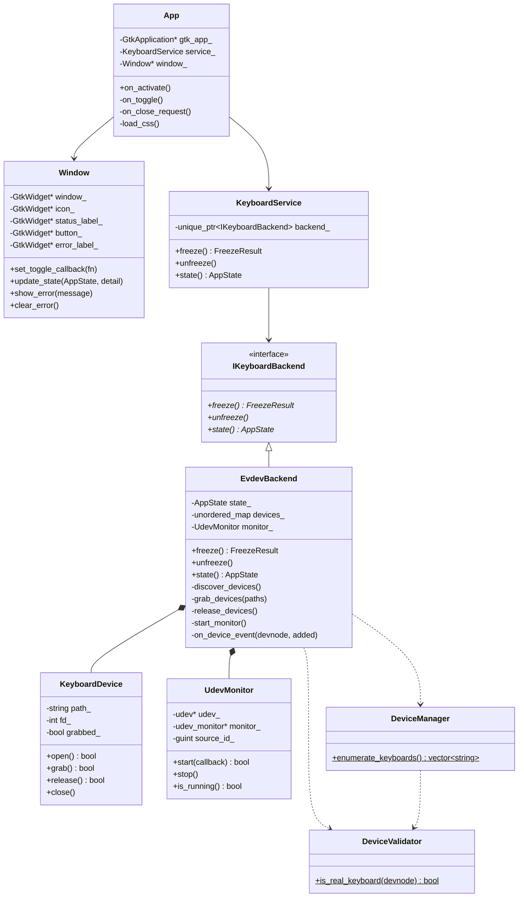
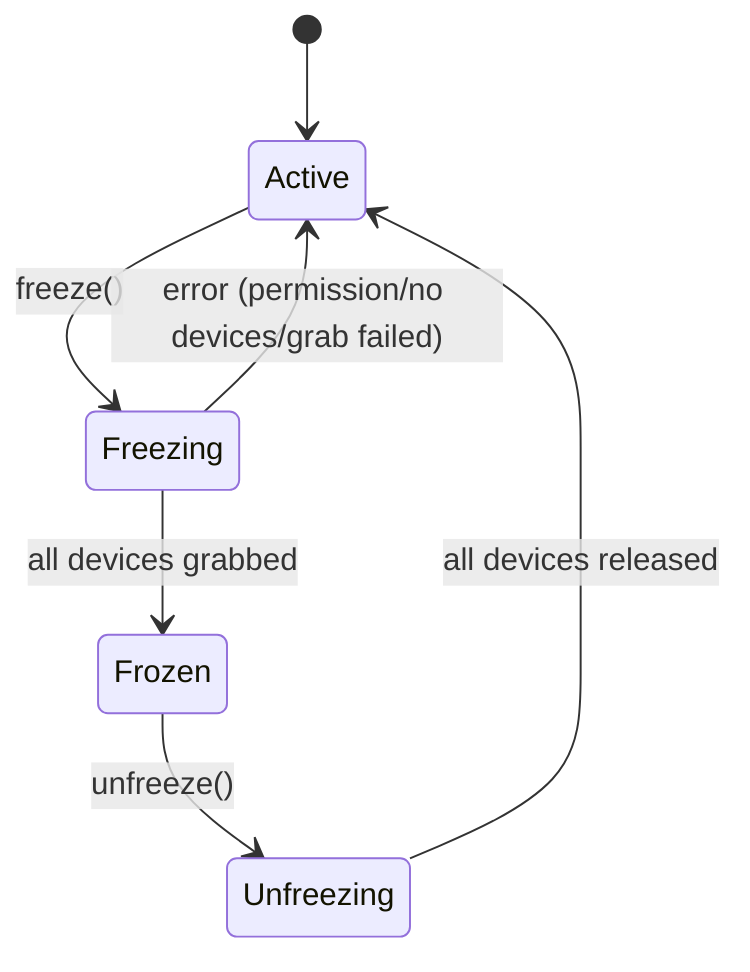

# Architecture

## Ownership Hierarchy

```
App                              (top-level, owns everything)
├── Window                       (GTK4 UI, knows nothing about evdev)
└── KeyboardService              (stable API for the UI)
    └── IKeyboardBackend*        (polymorphic interface)
         └── EvdevBackend        (concrete, uses EVIOCGRAB)
              ├── UdevMonitor    (hotplug, constructed once)
              └── devices_       (unordered_map<path, unique_ptr<KeyboardDevice>>)
```

## Class Diagram



## State Machine



## Freeze Sequence

```
User clicks "Disable Keyboard"
  ↓
App::on_toggle()
  ↓
KeyboardService::freeze()
  ↓
EvdevBackend::freeze()
  ↓
state_ = Freezing
  ↓
start_monitor()          ← catches hotplug from this point (race fix)
  ↓
discover_devices()       ← DeviceManager + DeviceValidator
  ↓
grab_devices()           ← open + EVIOCGRAB each device
  ↓
state_ = Frozen
  ↓
Window::update_state(Frozen)
```

## Unfreeze Sequence

```
User clicks "Enable Keyboard"
  ↓
App::on_toggle()
  ↓
KeyboardService::unfreeze()
  ↓
EvdevBackend::unfreeze()
  ↓
state_ = Unfreezing
  ↓
monitor_.stop()          ← no new devices will arrive
  ↓
release_devices()        ← EVIOCGRAB(0) each device
  ↓
devices_.clear()         ← unique_ptr destructors close fds
  ↓
state_ = Active
  ↓
Window::update_state(Active)
```

## Hotplug Sequence

### Device Added

```
USB keyboard plugged in
  ↓
udev event → UdevMonitor::on_udev_event()
  ↓
Filter: ID_INPUT_KEYBOARD=1, not mouse/touchpad/joystick
  ↓
DeviceValidator::is_real_keyboard()
  ↓
EvdevBackend::on_device_event(path, added=true)
  ↓
Check devices_ map (O(1)) → skip if duplicate
  ↓
Create KeyboardDevice → open() → grab()
  ↓
Insert into devices_[path]
```

### Device Removed

```
USB keyboard unplugged
  ↓
udev event → UdevMonitor::on_udev_event()
  ↓
EvdevBackend::on_device_event(path, added=false)
  ↓
devices_.erase(path) → unique_ptr destructor → release() + close()
```

## Application Lifecycle

```
main()
  ↓
gtk_application_new("io.github.hyperafnan.CleanMyKeyboard")
  ↓
g_application_run()
  ↓
"activate" signal → App::on_activate()
  ↓
Load CSS → Create Window → Install signal handlers
  ↓
GTK main loop runs
  ├── Button clicks → App::on_toggle()
  ├── Window paint
  ├── udev monitor events (when frozen)
  └── Signal handlers (SIGINT/SIGTERM/SIGQUIT)
  ↓
Window "close-request" → service_.unfreeze() → destroy
  ↓
g_application_run() returns → cleanup → exit
```

## Signal Handling

Uses `g_unix_signal_add()` exclusively — no POSIX `sigaction()`.

```
SIGINT / SIGTERM / SIGQUIT
  ↓
GLib dispatches callback inside GTK main loop
  ↓
KeyboardService::unfreeze()  ← safe, runs on main thread
  ↓
g_application_quit()
```

## Backend Architecture

The `IKeyboardBackend` interface decouples the UI from the implementation:

```
Window → KeyboardService → IKeyboardBackend
                                ├── EvdevBackend (current)
                                └── PolkitBackend (future)
```

A future `PolkitBackend` would:
1. Communicate with a root D-Bus service
2. Use Polkit for authentication prompts
3. Implement the same `freeze()`/`unfreeze()`/`state()` interface

Zero changes to `Window` or `KeyboardService` would be needed.

## Device Filtering

Two-stage filtering prevents grabbing non-keyboard devices:

### Stage 1: udev properties (DeviceManager)
- ✅ `ID_INPUT_KEYBOARD=1`
- ❌ `ID_INPUT_MOUSE=1`
- ❌ `ID_INPUT_TOUCHPAD=1`
- ❌ `ID_INPUT_JOYSTICK=1`

### Stage 2: evdev capabilities (DeviceValidator)
- ✅ `EV_KEY` — has key events
- ✅ `EV_REP` — has auto-repeat (power buttons lack this)
